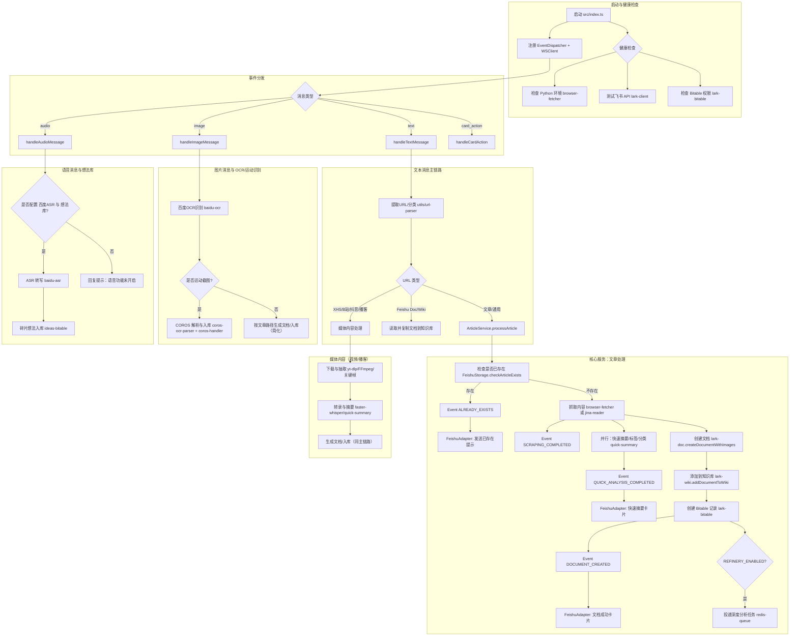

# 系统整体流程图

```mermaid
flowchart TD

subgraph Startup[启动与健康检查]
  A1[启动 src/index.ts] --> A2{健康检查}
  A2 --> A2a[检查 Python 环境 browser-fetcher]
  A2 --> A2b[测试飞书 API lark-client]
  A2 --> A2c[检查 Bitable 权限 lark-bitable]
  A1 --> A3[注册 EventDispatcher + WSClient]
end

subgraph Dispatch[事件分发]
  A3 --> D{消息类型}
  D -->|text| T[handleTextMessage]
  D -->|audio| V[handleAudioMessage]
  D -->|image| I[handleImageMessage]
  D -->|card_action| C[handleCardAction]
end

subgraph TextFlow[文本消息主链路]
  T --> T1[提取URL/分类 utils/url-parser]
  T1 --> T2{URL 类型}
  T2 -->|文章/通用| S[ArticleService.processArticle]
  T2 -->|Feishu Doc/Wiki| TW[读取并复制文档到知识库]
  T2 -->|XHS/B站/抖音/播客| M[媒体内容处理]
end

subgraph ArticleService[核心服务：文章处理]
  S --> S1[检查是否已存在 FeishuStorage.checkArticleExists]
  S1 -->|存在| S1e[Event ALREADY_EXISTS] --> AD1[FeishuAdapter: 发送已存在提示]
  S1 -->|不存在| S2[抓取内容 browser-fetcher 或 jina-reader]
  S2 --> S3[Event SCRAPING_COMPLETED]
  S2 --> S4[并行：快速摘要/标签/分类 quick-summary]
  S4 --> S4e[Event QUICK_ANALYSIS_COMPLETED] --> AD2[FeishuAdapter: 快速摘要卡片]
  S2 --> S5[创建文档 lark-doc.createDocumentWithImages]
  S5 --> S6[添加到知识库 lark-wiki.addDocumentToWiki]
  S6 --> S7[创建 Bitable 记录 lark-bitable]
  S7 --> S7e[Event DOCUMENT_CREATED] --> AD3[FeishuAdapter: 文档成功卡片]
  S7 --> S8{REFINERY_ENABLED?}
  S8 -->|是| S9[投递深度分析任务 redis-queue]
end

subgraph ImageFlow[图片消息与 OCR/运动识别]
  I --> I1[百度OCR识别 baidu-ocr]
  I1 --> I2{是否运动截图?}
  I2 -->|是| I3[COROS 解析与入库 coros-ocr-parser + coros-handler]
  I2 -->|否| I4[按文章路径生成文档/入库（简化）]
end

subgraph VoiceFlow[语音消息与想法库]
  V --> V1{是否配置 百度ASR 与 想法库?}
  V1 -->|是| V2[ASR 转写 baidu-asr] --> V3[碎片想法入库 ideas-bitable]
  V1 -->|否| V4[回复提示：语音功能未开启]
end

subgraph MediaFlow[媒体内容（视频/播客）]
  M --> M1[下载与抽取 yt-dlp/FFmpeg/关键帧]
  M1 --> M2[转录与摘要 faster-whisper/quick-summary]
  M2 --> M3[生成文档/入库（同主链路）]
end
```

